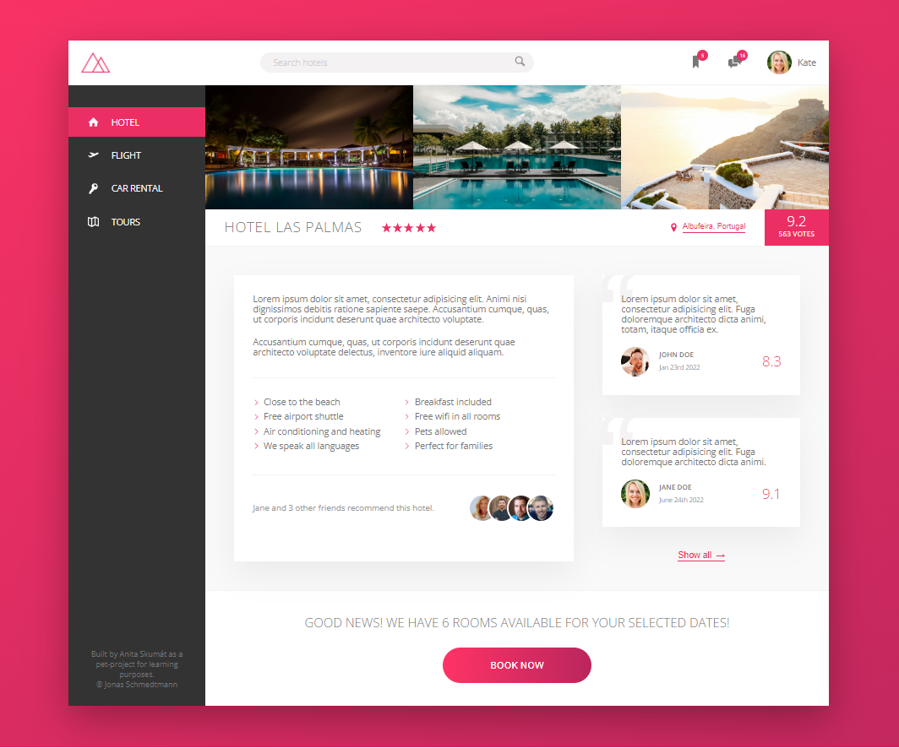

# Hotels

Hotels is one page of a fictive hotel site. It's a project for learning and practice

- flexbox
- SASS
- SVG icons

## Usage

1. Clone the project

2. Install *dependencies* listed in package.json (in the main folder)
```
npm install
```

3. Run the app in the development mode
```
npm run start
```

4. Build css to finalize by
```
npm run build:css
```


## Preview
